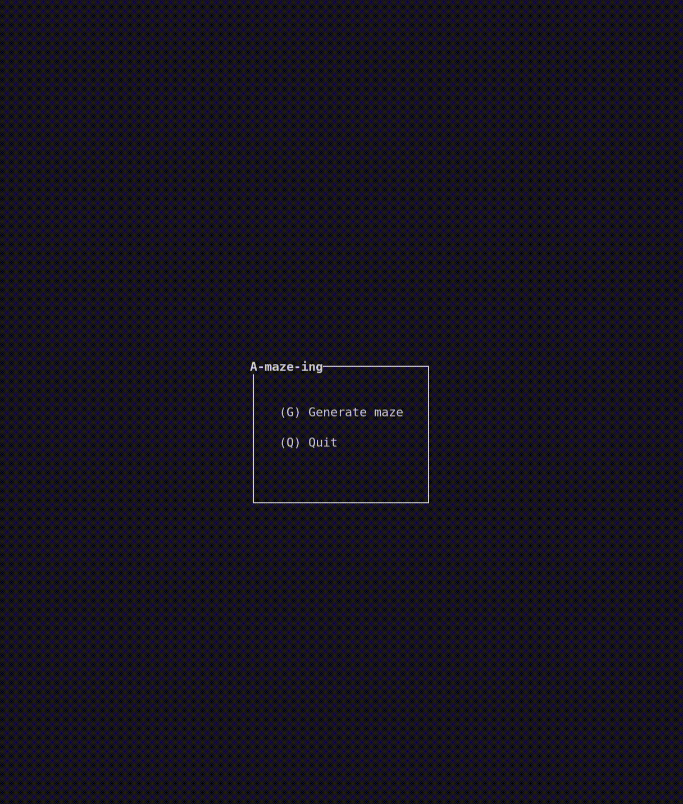

<h3 align="center">
  <em>Create your own maze generator and display its result!</em>
</h3>

---

<div align="center">
  
  
  
</div>

## ⚠️ Disclaimer

- **Full Portfolio:** This repository focuses on this specific project. You can find my entire
42 curriculum 👉 [here](https://github.com/martinnsanzz/42-Curriculum).
- **Subject Rules:** I strictly follow the rules regarding 42 subjects; I cannot share the PDFs,
but I explain the concepts in this README.
- **Archive State:** The code is preserved exactly as it was during evaluation (graded state).
I do not update it, so you can see my progress and mistakes from that time.
- **Academic Integrity:** I encourage you to try the project yourself first. Use this repo only
as a reference, not for copy-pasting. Be patient, you will succeed.
- **Group Project:** This project was done in a team composed by [Carlos](https://gitlab.com/Sustaxata)

## 📂 Description

**📜 Summary:**\
**Amazing** is a python `maze generator` project. It generates and solves a maze, then writes it
to a text file in a hexadecimal wall representation. This maze will be visually represented
using `curses` library. The maze will be generated randomly but can be reproduce using a
**seed**. The maze reads from a config file which is provided to set the program up. A `.whl`
file of the maze is provided as a standalone module for future use, this module provides a
**unique class**

**Note:** The config file can be edited on run time.

**📝 Requierements**\
The project addresses the following tasks:
- Generation of a maze
    - A perfect maze (A maze where any two points have exactly one connecting path).
    - Generation of an imperfect maze (A maze where any two points have more than one connecting path).
        - Every corridor is reachable (full connectivity), so the whole board can be filled with pac-gums and remains winnable.
        - The four corners and the centre are open corridors (the ghosts and super-pacgums sit in the corners, the player starts in the centre).
        - It offers at least two independent routes (loops), so that a chased player always has an alternative (a perfect maze, or a perfect maze with merely one wall removed (a single loop), is therefore not acceptable in this mode).
        - Dead-ends should stay rare (a couple are tolerated); a board with (ideally) no dead-end at all.
- Finding the shortest connecting path between two given cells.
- Visualising the output in a meaningful way.
- Drawing a visible 42 pattern in the centre of the maze.
- Packaging the project as a module so that it may be installed via pip.
- Output the result in a a textfile in hexadecimal format.

**👍 User can:**
- Re-generate a new maze and display it.
- Show a valid shortest path from the entrance to the exit.
- Select a generation algorithm: `kruskal` or `dfs`.
- Select a solve algorithm: `shrink`, `find`, `search`
- Change maze colours.
- Set a specific pattern on the maze: `42`, `square`, `star` or nothing.
- Select generation animation on or off.


**📮 Makefile:**\
This project must include a Makefile with the following rules:
- `make install`: Create venv and install dependencies
- `make run`: Run the program
- `make debug`: Run with debugger (pdb by default)
- `make lint`: Run flake8 and mypy
- `make lint-strict`: Run flake8 and mypy --strict
- `make clean`: Remove cache folders
- `make fclean`: Remove venv and cache
- `make wheel`: Builds .whl from src/mazegen package


## 🐨 Result

<tr>
    <td align="center">
      
    </td>
</tr>

## 🔷 Usage

### Clone repository
To use this project you first need to clone the repository in your directory.

```bash
git clone git@github.com:martinnsanzz/A-Maze-Ing.git
```

### Install dependencies
In order to run the project, first you need to install all the dependencies in a `venv` using
`Python3`. Make sure you have `venv` module installed in your computer.

```bash
make install
```

Once all dependencis are installed inside the `env` you will need to select the `venv` 
interpreter within the terminal. Clear messages are displayed with the **makefile**.

```bash
source ./env/bin/activate
```

### Running the project
Once everything run the program and follow the menu. Edit the config.txt while program is
running and re-generate the maze to see the changes.

```bash
make run
```

> Clear error messages will be shown if anything fails (Wrong config values)

---

## 📖Config File Format

The maze is configured through a plain text file using `KEY=VALUE` pairs, one per line.
Lines that start or contain `#` are ignored.

**🔑 Mandatory Keys**

| Key           | Description                  | Example              |
|---------------|-------------------------------|-----------------------|
| `WIDTH`       | Maze width (number of cells) | `WIDTH=20`            |
| `HEIGHT`      | Maze height (number of cells)| `HEIGHT=15`           |
| `ENTRY`       | Entry coordinates (x,y)      | `ENTRY=0,0`           |
| `EXIT`        | Exit coordinates (x,y)       | `EXIT=19,14`          |
| `OUTPUT_FILE` | Output filename              | `OUTPUT_FILE=maze.txt`|
| `PERFECT`     | Whether the maze is perfect  | `PERFECT=True`        |

*Notes:* Entry and exit point can't be the same and must be within the maze bounds
(0, width -1), (0, height - 1). Also this points can't be in a pattern cell or code will break.

**❓ Optional Keys**

| Key               | Description                          | Valid Values                 | Example                    |
|-------------------|----------------------------------------|-------------------------------|----------------------------|
| `SEED`            | Random seed for reproducible mazes   | any integer                   | `SEED=0`                   |
| `BUILD_ANIM`      | Whether to animate the build process | `True`, `False`                | `BUILD_ANIM=False`         |
| `BUILD_ALGORITHM` | Maze generation algorithm            | `kruskal`, `dfs`               | `BUILD_ALGORITHM=kruskal`  |
| `MAZE_PATTERN`    | Pattern drawn in the maze centre     | `42`, `square`, `star` or empty         | `MAZE_PATTERN=square`      |
| `SOLVE_ALGORITHM` | Pathfinding algorithm                | see below                      | `SOLVE_ALGORITHM=search`   |

`SOLVE_ALGORITHM` valid values depend on `PERFECT`:
- When `PERFECT=True`: `shrink`, `find`, `search`
- When `PERFECT=False`: `find`, `search`

### Example

```ini
WIDTH=30
HEIGHT=30
ENTRY=0,0
EXIT=29,29
OUTPUT_FILE=maze.txt
PERFECT=True
BUILD_ANIM=False
BUILD_ALGORITHM=kruskal
MAZE_PATTERN=square
SOLVE_ALGORITHM=search
```

## 📒 Tasks Division

| Module | Martin | Carlos |
|---|---|---|
| Makefile | ✅ | |
| Curses Framework Implentation | ✅ | |
| Maze and Cell logic | | ✅ |
| Pixel logic | | ✅ |
| Base Maze generation + Kruskal | | ✅ |
| DFS Maze Generation | | ✅ |
| Imperfect Maze Conversion | ✅ | |
| Config Parsing | ✅ | |
| Multiple Pattern implementation | ✅ | |
| Project structure | ✅ | |
| Pip / Wheel package implentation | ✅ | |
| Solver algorithms | | ✅ |
| Animation | | ✅ |


## 🤖 Algorithm and Data Structures

<h3><u>Generation Algorithms</u></h3>
Two algorithms were considered and implemented for the generation of the maze.
*Kruskal* and *DFS* both promised fast performance and simple implementation.

#### Kruskal
Kruskal maze generation works in a very simple way. Each cell starts with all walls closed. A random cell is selected and a wall to a neighbour that it is not yet connected to is opened.
The process is repeated until all cells are connected to each other.

This algorithm was adjusted for this project to make the resulting maze prettier. Instead of picking a random cell on every iteration, it first checks if the previously picked cell has eligible neighbours to connect to, if so it will continue this until that is no longer the case.
This results in the creation of several unconnected tunnels which eventually are all joined, reducing the number of short dead ends.

**Why Kruskal?**
Kruskal is based on a very simple principle, requires no recursion and can be quite performant. The resulting mazes are visually interesting as well. As its nature is quite simple it can be tweaked or adjusted relatively easily.


#### Depth First Search (DFS)
DFS generation is based on a simple principle which is to visit each cell that has not been visited. Given a starting cell, it is connected to one of its neighbours that has previously not been visited. If all neighbours have been visited, retrace your steps until one cell has an unvisited neighbour.

This was implemented using iteration, not recursion due to its performance benefits. The backtracking was implemented through the use of a stack. The visited cells being stored in a set for quick membership comparison

**Why DFS?**
DFS makes a lot of logical sense in its approach. While its implementation (without recursion) is not straight forward, the logic of it is very understandable and makes it very compelling. DFS mazes are also very pretty with longer corridors and fewer short dead ends


#### Imperfect Maze Conversion

Once a perfect maze has been generated, it is converted into an imperfect one by removing dead ends if the
PERFECT config is set to False.

The algorithm iterates over every cell in the grid, column by row. For each cell, its neighbours are collected
and checked against `is_dead_end`, which reads the cell's `walls` bitmask: a cell counts as a dead end only if it
has more than one neighbour and exactly one of its walls is open (bitmask `0b0111`, `0b1011`, `0b1101`, or
`0b1110`). Cells with a single neighbour (e.g. isolated cells inside the 42 pattern) are excluded from this check.

If a cell is found to be a dead end, a random neighbour is picked and the wall between the two cells is broken,
provided that wall is still closed. This is repeated in a loop until the cell no longer qualifies as a dead end,
since breaking one wall can still leave the cell with only one open connection depending on which wall was chosen.

If an animation function is provided, each wall break is rendered through `play_animation`, allowing the conversion process to be visualised step by step.

The result is a maze where, ideally, no dead ends remain, while the four corners, the centre, and full connectivity are preserved from the original perfect maze.

<h3><u>Pathfinding Algorithms</u></h3>

We implemented a total of 3 different pathfinding algorithms, one being an "original" creation which only works with perfect mazes, the other two being universal pathfinding algorithms that work on both perfect and imperfect mazes.

#### Shrink solver (perfect only):
This is an original creation based on a simple thought. In a perfect maze each cell has exactly one valid connection to all other cells, so if the maze is simply shrunk starting from all dead ends until the start and end cell is encountered, then the only cells leftover have to be cells on the path between start and end.
It is a visually satisfying path solver that can be quite performant due to its simplicity.

#### Search solver (universal):
Starting at the entry cell each neighbour represents a possible path. The solver explores each possible path by branchingat each neighbour. If a dead end is encountered, that path is eliminated, if a path loops onto another already existing path, that means it reaches the same cell in more steps, and is also eliminated. As a result the most efficient path is always found.

#### Find solver (universal):
This is likely an implementation of the Dykstra pathfinding algorithm.
Starting at the exit cell each neighbour is assigned a cost. This cost defines how far it is from the exit cell and the process is repeated with each of the neighbours neighbours with the cost increasing by one on each step.
Once the entry cell has been found and assigned a cost, a shortest path is posssible.
Now starting from the entry cell each neighbour with an assigned cost is compared and the one with the lowest cost is picked as the next step. The process is repeated until the exit cell is found.

## 🌲 Code Reusability

The maze generation logic is packaged separately as `mazegen`, a reusable Python module. Running `make wheel`
builds this package from `src/mazegen` and produces a `.whl` file in the project root, ready for distribution or
installation elsewhere.

To use it in another project, install the wheel directly with pip:

```bash
pip install <wheel_file>.whl
```

Once installed, `mazegen` behaves like any standard Python package and can be imported directly:

```python
from mazegen import MazeGenerator
mg = MazeGenerator(width = 10,
                   height = 10,
                   build_algorithm = "dfs",     # or "kruskal"
                   solve_algorithm = "find",    # or "search", "shrink"
                   perfect = True,
                   seed = None,
                   pattern = "42",              # or "square", "star", ""
                   animation = None)
maze = mg.generate()
solution, steps = mg.solve(maze, (0,0), (9,9))  # (0,0) entry; (9,9) exit
print(solution)                                 # Print the moves (eg. SEES)
print(maze.get_print_string())                  # Print the maze to screen
```

or ommiting the optional parameters:
```python
mg = MazeGenerator(width = 10,
                   height = 10,
                   build_algorithm = "dfs",
                   solve_algorithm = "find",
                   perfect = True)
maze = mg.generate()
solution, steps = mg.solve(maze, (0,0), (9,9))  # (0,0) entry; (9,9) exit
print(solution)                                 # Print the moves (eg. SEES)
print(maze.get_print_string())                  # Print the maze to screen
```


This module is build to be used on terminal. With the MazeGenerator instance you're able to
generate() and solve() a maze_grid as long as the correct parameters are passed. Use docstrings for more detailed guidance.

## 🧠 Project Reflection

**What Worked Well**

- Our cell, pixel, maze logic is pretty solid, separating logic and behaviour where it makes sense
- Maze generation and solving are working well
- Our decision to use composition over inheritance made us more flexible
- Our UI is looking pretty
- The change to pydantic over a dict saved us many hours
- Our use of branches for our git repo worked reasonably well

*What Could Be Improved**

- The UI could be restructured into a more generic modular approach - this would only make a difference in working with it, not the actual graphic output.
- Some of the code, in particular in the solve algorithms can be tidied up to make it more readable


## 📖 Resources

### **Algorithms:**
- [Maze generations](https://medium.com/analytics-vidhya/maze-generations-algorithms-and-visualizations-9f5e88a3ae37)
- [Maze Generation Algorithms](https://professor-l.github.io/mazes/)
- [Maze Generation Algorithms - Video](https://www.youtube.com/watch?v=ioUl1M77hww)
- [DFS Algorithm to solve a maze](https://medium.com/swlh/solving-mazes-with-depth-first-search-e315771317ae)
- [Depth First Search](https://medium.com/@nacerkroudir/randomized-depth-first-search-algorithm-for-maze-generation-fb2d83702742)
- [DFS Wiki](https://en.wikipedia.org/wiki/Maze_generation_algorithm)
- [Path Finding Algorithms Comparison](https://www.youtube.com/watch?v=GC-nBgi9r0U)
- [Pac-man Mazegen](https://shaunlebron.github.io/pacman-mazegen/)
- [Kruskal Algorithm](https://en.wikipedia.org/wiki/Kruskal's_algorithm)
- [Dykstra Pathfinding](https://en.wikipedia.org/wiki/Dijkstra's_algorithm)

### **Documentation**
- [W3Schools - Python](https://www.w3schools.com/python/default.asp)
- [Open-Source Software Licenses](https://license.md/popular-open-source-software-licenses/)
- [Curses](https://docs.python.org/3/howto/curses.html)
- [Python set operations](https://www.w3schools.com/python/python_ref_set.asp)
- [TypeAlias documentation](https://typing.python.org/en/latest/spec/aliases.html)
- [Google docstring Format](https://google.github.io/styleguide/pyguide.html#38-comments-and-docstrings)
- [Enums](https://docs.python.org/3/library/enum.html)
- [Random](https://docs.python.org/3/library/random.html)

### **Problem solving**
- [Python lists vs sets](https://stackoverflow.com/questions/2831212/python-sets-vs-lists)
- [Time vs datetime](https://stackoverflow.com/questions/7479777/difference-between-python-datetime-vs-time-modules)

### **Packages**
- [Software Licensing Examples](https://www.mend.io/blog/top-open-source-licenses-explained/)


**AI Usage**

AI was NOT used to generate code. All function implementations were written by Martin and Carlos ™.

Where AI was used:
- Help in resolving formatting issues e.g. figuring out how make a Callable typehint more readable
- The inital readme was sketched out to make sure we don't forget required sections
- Help when encountering very specific isolated problems such as how to get an item from a set
- Explaining complex concepts e.g. wheel vs tar, how to create packages
- Restructuring existing code into a more understandable manner e.g. naming files, variables,
file and folder placement